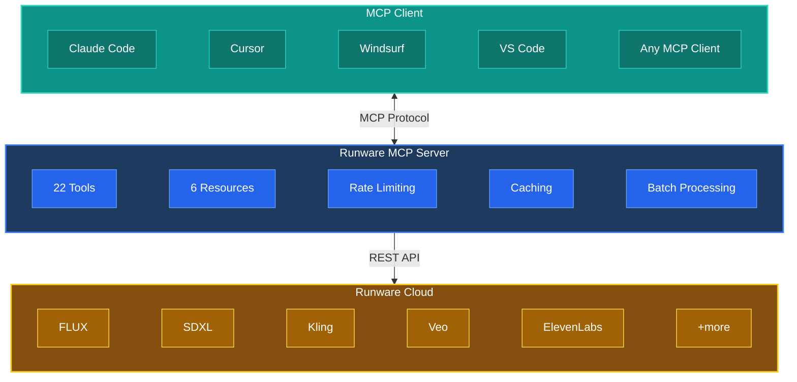
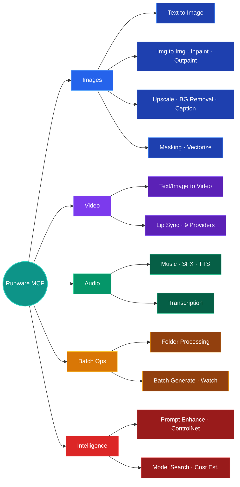
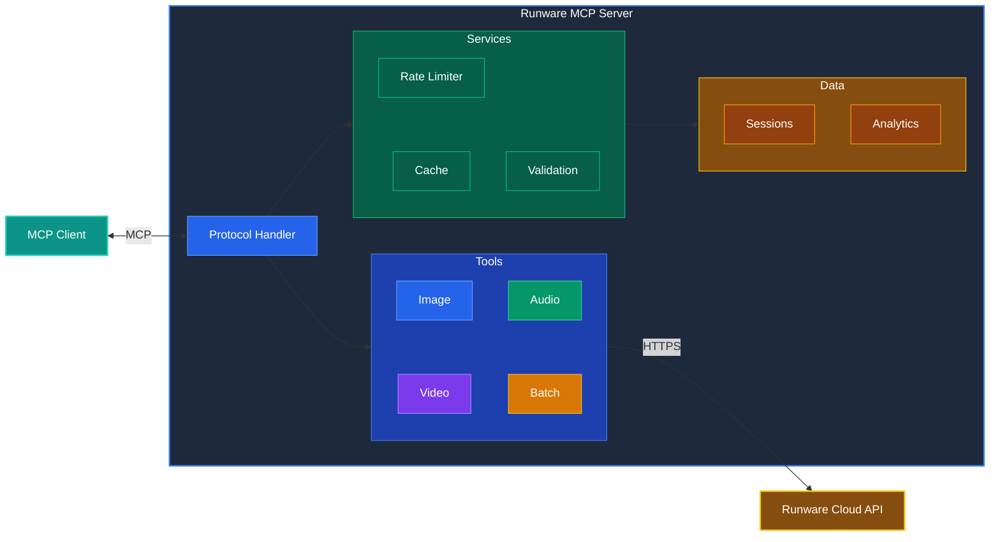

# Runware MCP Server

### AI Media Generation for Any MCP Client

<p align="center">
  
  
  
  
</p>

<p align="center">
  <strong>Turn any MCP-compatible AI assistant into a creative powerhouse.</strong><br>
  Images. Videos. Audio. Vectors. All from natural language.
</p>

---

## What Is This?

An MCP server that connects your AI coding assistant directly to Runware's AI media generation infrastructure. Works with any client that supports the [Model Context Protocol](https://modelcontextprotocol.io).


```mermaid
flowchart TB
    subgraph Client["MCP Client"]
        direction LR
        C1["Claude Code"] ~~~ C2["Cursor"] ~~~ C3["Windsurf"] ~~~ C4["VS Code"] ~~~ C5["Any MCP Client"]
    end

    Client <-->|"MCP Protocol"| Server

    subgraph Server["Runware MCP Server"]
        direction LR
        Tools["22 Tools"] ~~~ Resources["6 Resources"] ~~~ RL["Rate Limiting"] ~~~ Cache["Caching"] ~~~ Batch["Batch Processing"]
    end

    Server -->|"REST API"| Cloud

    subgraph Cloud["Runware Cloud"]
        direction LR
        FLUX["FLUX"] ~~~ SDXL["SDXL"] ~~~ Kling["Kling"] ~~~ Veo["Veo"] ~~~ EL["ElevenLabs"] ~~~ More["+more"]
    end

    style Client fill:#0d9488,stroke:#2dd4bf,stroke-width:2px,color:#fff
    style C1 fill:#0f766e,stroke:#2dd4bf,color:#fff
    style C2 fill:#0f766e,stroke:#2dd4bf,color:#fff
    style C3 fill:#0f766e,stroke:#2dd4bf,color:#fff
    style C4 fill:#0f766e,stroke:#2dd4bf,color:#fff
    style C5 fill:#0f766e,stroke:#2dd4bf,color:#fff
    style Server fill:#1e3a5f,stroke:#3b82f6,stroke-width:2px,color:#fff
    style Tools fill:#2563eb,stroke:#60a5fa,color:#fff
    style Resources fill:#2563eb,stroke:#60a5fa,color:#fff
    style RL fill:#2563eb,stroke:#60a5fa,color:#fff
    style Cache fill:#2563eb,stroke:#60a5fa,color:#fff
    style Batch fill:#2563eb,stroke:#60a5fa,color:#fff
    style Cloud fill:#854d0e,stroke:#facc15,stroke-width:2px,color:#fff
    style FLUX fill:#a16207,stroke:#fde047,color:#fff
    style SDXL fill:#a16207,stroke:#fde047,color:#fff
    style Kling fill:#a16207,stroke:#fde047,color:#fff
    style Veo fill:#a16207,stroke:#fde047,color:#fff
    style EL fill:#a16207,stroke:#fde047,color:#fff
    style More fill:#a16207,stroke:#fde047,color:#fff
```

**One config. Zero complexity. Infinite creativity.**

---

## Installation

Add the server to your MCP client config:

```json
{
  "mcpServers": {
    "runware": {
      "command": "npx",
      "args": ["-y", "@runware/mcp-server"],
      "env": {
        "RUNWARE_API_KEY": "your-api-key"
      }
    }
  }
}
```

### Config locations by client

<table>
<thead>
  <tr>
    <th bgcolor="#0d1117"><font color="#58a6ff">Client</font></th>
    <th bgcolor="#0d1117"><font color="#58a6ff">Config Location</font></th>
  </tr>
</thead>
<tbody>
  <tr>
    <td>**Claude Code**</td>
    <td>`~/.claude.json` or project `.mcp.json`</td>
  </tr>
  <tr>
    <td>**Claude Desktop (macOS)**</td>
    <td>`~/Library/Application Support/Claude/claude_desktop_config.json`</td>
  </tr>
  <tr>
    <td>**Claude Desktop (Linux)**</td>
    <td>`~/.config/claude/claude_desktop_config.json`</td>
  </tr>
  <tr>
    <td>**Claude Desktop (Windows)**</td>
    <td>`%APPDATA%\Claude\claude_desktop_config.json`</td>
  </tr>
  <tr>
    <td>**Cursor**</td>
    <td>`.cursor/mcp.json` in your project root</td>
  </tr>
  <tr>
    <td>**Windsurf**</td>
    <td>`~/.codeium/windsurf/mcp_config.json`</td>
  </tr>
  <tr>
    <td>**VS Code (Copilot)**</td>
    <td>`.vscode/mcp.json` in your project root</td>
  </tr>
</tbody>
</table>

> **Note:** Config format may vary slightly by client. Check your client's MCP documentation for exact syntax.

That's it. No `pip install`. No virtual environments. No Python version conflicts. Just paste, restart, create.

---

## Capabilities at a Glance


```mermaid
flowchart LR
    R((Runware MCP)) --> IMG[Images]
    R --> VID[Video]
    R --> AUD[Audio]
    R --> BATCH[Batch Ops]
    R --> INT[Intelligence]

    IMG --> I1[Text to Image]
    IMG --> I2[Img to Img &middot; Inpaint &middot; Outpaint]
    IMG --> I3[Upscale &middot; BG Removal &middot; Caption]
    IMG --> I4[Masking &middot; Vectorize]

    VID --> V1[Text/Image to Video]
    VID --> V2[Lip Sync &middot; 9 Providers]

    AUD --> A1[Music &middot; SFX &middot; TTS]
    AUD --> A2[Transcription]

    BATCH --> B1[Folder Processing]
    BATCH --> B2[Batch Generate &middot; Watch]

    INT --> N1[Prompt Enhance &middot; ControlNet]
    INT --> N2[Model Search &middot; Cost Est.]

    style R fill:#0d9488,stroke:#2dd4bf,stroke-width:2px,color:#fff
    style IMG fill:#2563eb,stroke:#60a5fa,color:#fff
    style VID fill:#7c3aed,stroke:#a78bfa,color:#fff
    style AUD fill:#059669,stroke:#34d399,color:#fff
    style BATCH fill:#d97706,stroke:#fbbf24,color:#fff
    style INT fill:#dc2626,stroke:#f87171,color:#fff

    style I1 fill:#1e40af,stroke:#3b82f6,color:#fff
    style I2 fill:#1e40af,stroke:#3b82f6,color:#fff
    style I3 fill:#1e40af,stroke:#3b82f6,color:#fff
    style I4 fill:#1e40af,stroke:#3b82f6,color:#fff
    style V1 fill:#5b21b6,stroke:#8b5cf6,color:#fff
    style V2 fill:#5b21b6,stroke:#8b5cf6,color:#fff
    style A1 fill:#065f46,stroke:#10b981,color:#fff
    style A2 fill:#065f46,stroke:#10b981,color:#fff
    style B1 fill:#92400e,stroke:#f59e0b,color:#fff
    style B2 fill:#92400e,stroke:#f59e0b,color:#fff
    style N1 fill:#991b1b,stroke:#ef4444,color:#fff
    style N2 fill:#991b1b,stroke:#ef4444,color:#fff
```

---

## The Complete Toolset

### Image Generation & Manipulation

<table>
<thead>
  <tr>
    <th bgcolor="#0d1117"><font color="#58a6ff">Tool</font></th>
    <th bgcolor="#0d1117"><font color="#58a6ff">What It Does</font></th>
    <th bgcolor="#0d1117"><font color="#58a6ff">Key Features</font></th>
  </tr>
</thead>
<tbody>
  <tr>
    <td>`imageInference`</td>
    <td>Text/image to images</td>
    <td>60+ parameters, LoRA, ControlNet, IP-Adapters</td>
  </tr>
  <tr>
    <td>`photoMaker`</td>
    <td>Preserve identity across generations</td>
    <td>Face consistency, style transfer</td>
  </tr>
  <tr>
    <td>`imageUpscale`</td>
    <td>Enhance resolution up to 4x</td>
    <td>Multiple algorithms, preserve details</td>
  </tr>
  <tr>
    <td>`imageBackgroundRemoval`</td>
    <td>Remove backgrounds instantly</td>
    <td>Alpha matting, custom colors</td>
  </tr>
  <tr>
    <td>`imageCaption`</td>
    <td>Describe images in detail</td>
    <td>Multiple models, structured output</td>
  </tr>
  <tr>
    <td>`imageMasking`</td>
    <td>Generate segmentation masks</td>
    <td>Face, body, hands detection</td>
  </tr>
  <tr>
    <td>`imageUpload`</td>
    <td>Upload local images</td>
    <td>Base64, URL, data URI support</td>
  </tr>
  <tr>
    <td>`vectorize`</td>
    <td>Convert raster to SVG</td>
    <td>Perfect for logos, icons</td>
  </tr>
</tbody>
</table>

### Video Generation

<table>
<thead>
  <tr>
    <th bgcolor="#0d1117"><font color="#58a6ff">Tool</font></th>
    <th bgcolor="#0d1117"><font color="#58a6ff">What It Does</font></th>
    <th bgcolor="#0d1117"><font color="#58a6ff">Providers</font></th>
  </tr>
</thead>
<tbody>
  <tr>
    <td>`videoInference`</td>
    <td>Create videos from text/images</td>
    <td>Kling, Veo, MiniMax, PixVerse, Runway, Vidu, Wan, Sync</td>
  </tr>
  <tr>
    <td>`listVideoModels`</td>
    <td>Browse available models</td>
    <td>All providers with specs</td>
  </tr>
  <tr>
    <td>`getVideoModelInfo`</td>
    <td>Get model details</td>
    <td>Dimensions, duration, features</td>
  </tr>
</tbody>
</table>

### Audio Generation

<table>
<thead>
  <tr>
    <th bgcolor="#0d1117"><font color="#58a6ff">Tool</font></th>
    <th bgcolor="#0d1117"><font color="#58a6ff">What It Does</font></th>
    <th bgcolor="#0d1117"><font color="#58a6ff">Features</font></th>
  </tr>
</thead>
<tbody>
  <tr>
    <td>`audioInference`</td>
    <td>Generate music, SFX, speech</td>
    <td>ElevenLabs, Mirelo, 14 voices</td>
  </tr>
  <tr>
    <td>`transcription`</td>
    <td>Video to text transcription</td>
    <td>Multiple languages</td>
  </tr>
</tbody>
</table>

### Creative Tools

<table>
<thead>
  <tr>
    <th bgcolor="#0d1117"><font color="#58a6ff">Tool</font></th>
    <th bgcolor="#0d1117"><font color="#58a6ff">What It Does</font></th>
    <th bgcolor="#0d1117"><font color="#58a6ff">Use Cases</font></th>
  </tr>
</thead>
<tbody>
  <tr>
    <td>`promptEnhance`</td>
    <td>Supercharge your prompts</td>
    <td>1-5 variations, AI enrichment</td>
  </tr>
  <tr>
    <td>`controlNetPreprocess`</td>
    <td>Prepare images for ControlNet</td>
    <td>12 preprocessors</td>
  </tr>
  <tr>
    <td>`styleTransfer`</td>
    <td>Apply artistic styles</td>
    <td>Combine with any model</td>
  </tr>
</tbody>
</table>

### Utilities

<table>
<thead>
  <tr>
    <th bgcolor="#0d1117"><font color="#58a6ff">Tool</font></th>
    <th bgcolor="#0d1117"><font color="#58a6ff">What It Does</font></th>
    <th bgcolor="#0d1117"><font color="#58a6ff">Why It Matters</font></th>
  </tr>
</thead>
<tbody>
  <tr>
    <td>`modelSearch`</td>
    <td>Search 100,000+ models</td>
    <td>Find the perfect model</td>
  </tr>
  <tr>
    <td>`costEstimate`</td>
    <td>Estimate before generating</td>
    <td>Budget control</td>
  </tr>
  <tr>
    <td>`getAccountBalance`</td>
    <td>Check your credits</td>
    <td>Never run dry</td>
  </tr>
</tbody>
</table>

### Batch Operations

<table>
<thead>
  <tr>
    <th bgcolor="#0d1117"><font color="#58a6ff">Tool</font></th>
    <th bgcolor="#0d1117"><font color="#58a6ff">What It Does</font></th>
    <th bgcolor="#0d1117"><font color="#58a6ff">Power Features</font></th>
  </tr>
</thead>
<tbody>
  <tr>
    <td>`processFolder`</td>
    <td>Process entire folders</td>
    <td>Upscale, remove BG, caption, vectorize</td>
  </tr>
  <tr>
    <td>`batchImageInference`</td>
    <td>Generate from multiple prompts</td>
    <td>Concurrent processing</td>
  </tr>
  <tr>
    <td>`watchFolder`</td>
    <td>Auto-process new files</td>
    <td>Pipelines, debouncing</td>
  </tr>
</tbody>
</table>

---

## Provider-Specific Features

This server exposes the **full capabilities** of each provider:

<table>
<thead>
  <tr>
    <th bgcolor="#0d1117"><font color="#58a6ff">Provider</font></th>
    <th bgcolor="#0d1117"><font color="#58a6ff">Exclusive Features</font></th>
  </tr>
</thead>
<tbody>
  <tr>
    <td>**Alibaba (Wan)**</td>
    <td>Prompt extension, multi-shot videos, audio generation</td>
  </tr>
  <tr>
    <td>**Black Forest Labs**</td>
    <td>Safety tolerance, raw mode, prompt upsampling</td>
  </tr>
  <tr>
    <td>**Bria**</td>
    <td>Content moderation, medium selection, fast mode</td>
  </tr>
  <tr>
    <td>**Ideogram**</td>
    <td>65+ style types, color palettes, magic prompt</td>
  </tr>
  <tr>
    <td>**ByteDance**</td>
    <td>Sequential image narratives (1-15 images)</td>
  </tr>
  <tr>
    <td>**KlingAI**</td>
    <td>Sound generation, camera fixed mode</td>
  </tr>
  <tr>
    <td>**PixVerse**</td>
    <td>20 viral effects, 21 camera movements, multi-clip</td>
  </tr>
  <tr>
    <td>**Google Veo**</td>
    <td>Prompt enhancement, audio generation (Veo 3)</td>
  </tr>
  <tr>
    <td>**Sync.so**</td>
    <td>Lip sync, speaker detection, audio segments</td>
  </tr>
</tbody>
</table>

---

## MCP Resources

Access your generated content programmatically:

<table>
<thead>
  <tr>
    <th bgcolor="#0d1117"><font color="#58a6ff">Resource URI</font></th>
    <th bgcolor="#0d1117"><font color="#58a6ff">Description</font></th>
  </tr>
</thead>
<tbody>
  <tr>
    <td>`runware://images/{id}`</td>
    <td>Generated images with metadata</td>
  </tr>
  <tr>
    <td>`runware://videos/{id}`</td>
    <td>Generated videos with metadata</td>
  </tr>
  <tr>
    <td>`runware://audio/{id}`</td>
    <td>Generated audio with metadata</td>
  </tr>
  <tr>
    <td>`runware://session/history`</td>
    <td>Full session generation history</td>
  </tr>
  <tr>
    <td>`runware://analytics/{period}`</td>
    <td>Usage analytics (day/week/month/all)</td>
  </tr>
</tbody>
</table>

---

## Prompt Templates

Pre-built workflows for common tasks:

<table>
<thead>
  <tr>
    <th bgcolor="#0d1117"><font color="#58a6ff">Template</font></th>
    <th bgcolor="#0d1117"><font color="#58a6ff">Perfect For</font></th>
  </tr>
</thead>
<tbody>
  <tr>
    <td>`product-photo`</td>
    <td>E-commerce, catalogs, marketing</td>
  </tr>
  <tr>
    <td>`avatar-generator`</td>
    <td>Profile pictures, characters</td>
  </tr>
  <tr>
    <td>`video-scene`</td>
    <td>Storyboarding, content creation</td>
  </tr>
  <tr>
    <td>`style-transfer`</td>
    <td>Artistic transformations</td>
  </tr>
  <tr>
    <td>`ui-mockup`</td>
    <td>Web/mobile design prototypes</td>
  </tr>
  <tr>
    <td>`thumbnail`</td>
    <td>YouTube, articles, social media</td>
  </tr>
  <tr>
    <td>`music-composition`</td>
    <td>Background music, jingles</td>
  </tr>
</tbody>
</table>

---

## Documentation

This MCP server includes **comprehensive built-in documentation** accessible as MCP resources. Any connected client can discover and read detailed API references, feature guides, and provider docs on demand.

**42 documentation resources** organized across 5 categories:

<table>
<thead>
  <tr>
    <th bgcolor="#0d1117"><font color="#58a6ff">Category</font></th>
    <th bgcolor="#0d1117"><font color="#58a6ff">Count</font></th>
    <th bgcolor="#0d1117"><font color="#58a6ff">What's Covered</font></th>
  </tr>
</thead>
<tbody>
  <tr>
    <td>**Concepts**</td>
    <td>5</td>
    <td>AIR identifiers, task responses, output types, async delivery, connection</td>
  </tr>
  <tr>
    <td>**Tools**</td>
    <td>13</td>
    <td>Full parameter reference for every tool</td>
  </tr>
  <tr>
    <td>**Features**</td>
    <td>10</td>
    <td>ControlNet, LoRA, IP-Adapters, prompt weighting, acceleration, and more</td>
  </tr>
  <tr>
    <td>**Providers**</td>
    <td>9</td>
    <td>Provider-specific settings and capabilities</td>
  </tr>
  <tr>
    <td>**Guides**</td>
    <td>5</td>
    <td>Batch processing, cost optimization, quality tuning, combining features</td>
  </tr>
</tbody>
</table>

Example URIs: `runware://docs/tools/image-inference`, `runware://docs/features/controlnet-guide`, `runware://docs/providers/kling-ai`, `runware://docs/guides/cost-optimization`

Ask your AI assistant to list or read any `runware://docs/*` resource for detailed reference information.

---

## Architecture


```mermaid
flowchart LR
    Client["MCP Client"] <-->|"MCP"| Handler

    subgraph Server["Runware MCP Server"]
        Handler["Protocol Handler"]
        Handler --> Tools & Core
        Core --> Data

        subgraph Tools["Tools"]
            direction TB
            IMG["Image"] ~~~ VID["Video"]
            AUD["Audio"] ~~~ BATCH["Batch"]
        end

        subgraph Core["Services"]
            direction TB
            RL["Rate Limiter"] ~~~ Cache["Cache"]
            Val["Validation"]
        end

        subgraph Data["Data"]
            direction TB
            Session["Sessions"]
            Analytics["Analytics"]
        end
    end

    Tools -->|"HTTPS"| API["Runware Cloud API"]

    style Client fill:#0d9488,stroke:#2dd4bf,stroke-width:2px,color:#fff
    style Server fill:#1e293b,stroke:#3b82f6,stroke-width:2px,color:#fff
    style Handler fill:#2563eb,stroke:#60a5fa,color:#fff
    style Tools fill:#1e40af,stroke:#3b82f6,color:#fff
    style Core fill:#065f46,stroke:#10b981,color:#fff
    style Data fill:#854d0e,stroke:#facc15,color:#fff
    style IMG fill:#2563eb,stroke:#60a5fa,color:#fff
    style VID fill:#7c3aed,stroke:#a78bfa,color:#fff
    style AUD fill:#059669,stroke:#34d399,color:#fff
    style BATCH fill:#d97706,stroke:#fbbf24,color:#fff
    style RL fill:#065f46,stroke:#10b981,color:#fff
    style Cache fill:#065f46,stroke:#10b981,color:#fff
    style Val fill:#065f46,stroke:#10b981,color:#fff
    style Session fill:#92400e,stroke:#f59e0b,color:#fff
    style Analytics fill:#92400e,stroke:#f59e0b,color:#fff
    style API fill:#854d0e,stroke:#facc15,stroke-width:2px,color:#fff
```

---

## What's Included

A ground-up TypeScript rewrite covering **100% of the Runware API**.

<table>
<thead>
  <tr>
    <th bgcolor="#0d1117"><font color="#58a6ff">Feature</font></th>
    <th bgcolor="#0d1117"><font color="#58a6ff">Details</font></th>
  </tr>
</thead>
<tbody>
  <tr>
    <td>**API Coverage**</td>
    <td>100% — every endpoint, every parameter</td>
  </tr>
  <tr>
    <td>**Tools**</td>
    <td>22 tools across image, video, audio, and batch ops</td>
  </tr>
  <tr>
    <td>**Providers**</td>
    <td>9 providers with full provider-specific settings</td>
  </tr>
  <tr>
    <td>**Type Safety**</td>
    <td>Strict TypeScript + Zod validation on every input</td>
  </tr>
  <tr>
    <td>**Security**</td>
    <td>SSRF protection, rate limiting, path traversal prevention</td>
  </tr>
  <tr>
    <td>**Testing**</td>
    <td>80%+ coverage across 1300+ tests</td>
  </tr>
  <tr>
    <td>**Install**</td>
    <td>`npx @runware/mcp-server` — zero setup</td>
  </tr>
</tbody>
</table>

---

## Video Model Comparison

<table>
<thead>
  <tr>
    <th bgcolor="#0d1117"><font color="#58a6ff">Provider</font></th>
    <th bgcolor="#0d1117"><font color="#58a6ff">Models</font></th>
    <th bgcolor="#0d1117"><font color="#58a6ff">Max Resolution</font></th>
    <th bgcolor="#0d1117"><font color="#58a6ff">Max Duration</font></th>
    <th bgcolor="#0d1117"><font color="#58a6ff">Special Features</font></th>
  </tr>
</thead>
<tbody>
  <tr>
    <td>**KlingAI**</td>
    <td>10</td>
    <td>1920x1080</td>
    <td>10s</td>
    <td>Sound, camera lock</td>
  </tr>
  <tr>
    <td>**Google Veo**</td>
    <td>3</td>
    <td>1920x1080</td>
    <td>8s</td>
    <td>Audio gen (Veo 3)</td>
  </tr>
  <tr>
    <td>**MiniMax**</td>
    <td>4</td>
    <td>1920x1080</td>
    <td>5s</td>
    <td>Fast generation</td>
  </tr>
  <tr>
    <td>**PixVerse**</td>
    <td>3</td>
    <td>1280x720</td>
    <td>4s</td>
    <td>Viral effects</td>
  </tr>
  <tr>
    <td>**Vidu**</td>
    <td>4</td>
    <td>1280x720</td>
    <td>4s</td>
    <td>Reference videos</td>
  </tr>
  <tr>
    <td>**Wan/Alibaba**</td>
    <td>2</td>
    <td>1280x720</td>
    <td>5s</td>
    <td>Multi-shot</td>
  </tr>
  <tr>
    <td>**Runway**</td>
    <td>2</td>
    <td>1920x1080</td>
    <td>10s</td>
    <td>Professional</td>
  </tr>
  <tr>
    <td>**Sync.so**</td>
    <td>1</td>
    <td>1920x1080</td>
    <td>60s</td>
    <td>Lip sync</td>
  </tr>
</tbody>
</table>

---

## ControlNet Preprocessors

<table>
<thead>
  <tr>
    <th bgcolor="#0d1117"><font color="#58a6ff">Preprocessor</font></th>
    <th bgcolor="#0d1117"><font color="#58a6ff">Use Case</font></th>
    <th bgcolor="#0d1117"><font color="#58a6ff">Best For</font></th>
  </tr>
</thead>
<tbody>
  <tr>
    <td>`canny`</td>
    <td>Edge detection</td>
    <td>Architectural, product</td>
  </tr>
  <tr>
    <td>`depth`</td>
    <td>Depth mapping</td>
    <td>Scenes, landscapes</td>
  </tr>
  <tr>
    <td>`mlsd`</td>
    <td>Line segments</td>
    <td>Interior design</td>
  </tr>
  <tr>
    <td>`normalbae`</td>
    <td>Normal maps</td>
    <td>3D-like rendering</td>
  </tr>
  <tr>
    <td>`openpose`</td>
    <td>Human pose</td>
    <td>Character art</td>
  </tr>
  <tr>
    <td>`tile`</td>
    <td>Tile processing</td>
    <td>Textures, patterns</td>
  </tr>
  <tr>
    <td>`seg`</td>
    <td>Segmentation</td>
    <td>Complex scenes</td>
  </tr>
  <tr>
    <td>`lineart`</td>
    <td>Line extraction</td>
    <td>Illustrations</td>
  </tr>
  <tr>
    <td>`lineart_anime`</td>
    <td>Anime lines</td>
    <td>Anime, manga</td>
  </tr>
  <tr>
    <td>`shuffle`</td>
    <td>Content shuffle</td>
    <td>Abstract, creative</td>
  </tr>
  <tr>
    <td>`scribble`</td>
    <td>Scribble style</td>
    <td>Concept art</td>
  </tr>
  <tr>
    <td>`softedge`</td>
    <td>Soft edges</td>
    <td>Soft, dreamy</td>
  </tr>
</tbody>
</table>

---

## Configuration Reference

<table>
<thead>
  <tr>
    <th bgcolor="#0d1117"><font color="#58a6ff">Variable</font></th>
    <th bgcolor="#0d1117"><font color="#58a6ff">Default</font></th>
    <th bgcolor="#0d1117"><font color="#58a6ff">Description</font></th>
  </tr>
</thead>
<tbody>
  <tr>
    <td>`RUNWARE_API_KEY`</td>
    <td>**required**</td>
    <td>Your Runware API key</td>
  </tr>
  <tr>
    <td>`NODE_ENV`</td>
    <td>`production`</td>
    <td>Environment mode</td>
  </tr>
  <tr>
    <td>`LOG_LEVEL`</td>
    <td>`info`</td>
    <td>Logging verbosity</td>
  </tr>
  <tr>
    <td>`MAX_FILE_SIZE_MB`</td>
    <td>`50`</td>
    <td>Max upload size</td>
  </tr>
  <tr>
    <td>`REQUEST_TIMEOUT_MS`</td>
    <td>`60000`</td>
    <td>API timeout</td>
  </tr>
  <tr>
    <td>`POLL_MAX_ATTEMPTS`</td>
    <td>`150`</td>
    <td>Video poll attempts</td>
  </tr>
  <tr>
    <td>`RATE_LIMIT_MAX_TOKENS`</td>
    <td>`10`</td>
    <td>Rate limit burst</td>
  </tr>
  <tr>
    <td>`RATE_LIMIT_REFILL_RATE`</td>
    <td>`1`</td>
    <td>Tokens per second</td>
  </tr>
  <tr>
    <td>`WATCH_FOLDERS`</td>
    <td>—</td>
    <td>Auto-watch folders</td>
  </tr>
  <tr>
    <td>`WATCH_DEBOUNCE_MS`</td>
    <td>`500`</td>
    <td>Watch debounce</td>
  </tr>
</tbody>
</table>

---

## Security

<table>
<thead>
  <tr>
    <th bgcolor="#0d1117"><font color="#58a6ff">Protection</font></th>
    <th bgcolor="#0d1117"><font color="#58a6ff">Implementation</font></th>
  </tr>
</thead>
<tbody>
  <tr>
    <td>**Input Validation**</td>
    <td>Zod schemas on every tool</td>
  </tr>
  <tr>
    <td>**Path Traversal**</td>
    <td>Canonicalization + symlink resolution</td>
  </tr>
  <tr>
    <td>**SSRF Protection**</td>
    <td>Private IP + metadata endpoint blocking</td>
  </tr>
  <tr>
    <td>**Rate Limiting**</td>
    <td>Token bucket algorithm</td>
  </tr>
  <tr>
    <td>**Error Sanitization**</td>
    <td>No stack traces or paths leaked</td>
  </tr>
</tbody>
</table>

---

## Example Workflows

### Product Photography Pipeline
```
You: "Process all images in /photos/products - remove backgrounds,
      upscale 2x, and save as PNGs to /photos/processed"
Assistant uses processFolder with removeBackground and upscale pipeline
```

### Video Storyboard
```
You: "Create a 3-part video story: sunrise over mountains,
      eagle soaring, landing on a branch. Use Kling, 5s each."

Assistant generates 3 coordinated videos with consistent style
```

### Brand Asset Generation
```
You: "Generate 5 logo variations for 'TechFlow' - modern, minimal,
      tech-focused. Then vectorize the best one."

Assistant uses imageInference, selects best, then vectorize to SVG
```

### Music + Video
```
You: "Create a 30-second promo video with matching background music"

Assistant uses videoInference + audioInference in parallel
```

---

## Development

```bash
git clone https://github.com/runware/mcp-server
cd mcp-server
npm install
npm run build
npm test
```

<table>
<thead>
  <tr>
    <th bgcolor="#0d1117"><font color="#58a6ff">Command</font></th>
    <th bgcolor="#0d1117"><font color="#58a6ff">Purpose</font></th>
  </tr>
</thead>
<tbody>
  <tr>
    <td>`npm run build`</td>
    <td>Compile TypeScript</td>
  </tr>
  <tr>
    <td>`npm run dev`</td>
    <td>Watch mode</td>
  </tr>
  <tr>
    <td>`npm run typecheck`</td>
    <td>Type checking</td>
  </tr>
  <tr>
    <td>`npm run lint`</td>
    <td>Lint with strict rules</td>
  </tr>
  <tr>
    <td>`npm run test`</td>
    <td>Run tests</td>
  </tr>
  <tr>
    <td>`npm run test:coverage`</td>
    <td>Coverage report</td>
  </tr>
</tbody>
</table>

---

## Contributing

See **[CONTRIBUTING.md](CONTRIBUTING.md)** for the full development guide including project structure, how to add new tools, testing patterns, and code style.

1. Fork it
2. Create a feature branch
3. Make it pass: `npm run build && npm run lint && npm test`
4. Submit PR

For version history and release notes, see **[CHANGELOG.md](CHANGELOG.md)**.

---

## License

MIT

---

<p align="center">
  <strong>Built for creators who demand more from their AI tools.</strong>
</p>

<p align="center">
  <sub>22 tools. 9 providers. 100% API coverage. Zero complexity.</sub>
</p>
