# Runware MCP Server

### The AI Media Orchestration Layer for Claude Code

<p align="center">
  
  
  
  
</p>

<p align="center">
  <strong>Turn Claude Code into a creative powerhouse.</strong><br>
  Images. Videos. Audio. Vectors. All from natural language.
</p>

---

## What Is This?

This is a **control plane layer** that connects Claude Code directly to Runware's AI media generation infrastructure.


**One config. Zero complexity. Infinite creativity.**

---

## Installation

Add this to your Claude Code config and you're done:

```json
{
  "mcpServers": {
    "runware": {
      "command": "npx",
      "args": ["-y", "@runware/mcp-server"],
      "env": {
        "RUNWARE_API_KEY": "your-api-key"
      }
    }
  }
}
```

| Platform | Config Location |
|----------|-----------------|
| **macOS** | `~/.claude/claude_desktop_config.json` |
| **Linux** | `~/.config/claude/claude_desktop_config.json` |
| **Windows** | `%APPDATA%\Claude\claude_desktop_config.json` |

That's it. No `pip install`. No virtual environments. No Python version conflicts. Just paste, restart, create.

---

## Capabilities at a Glance

```mermaid
%%{init: {'theme': 'base', 'themeVariables': { 'primaryColor': '#3b82f6', 'primaryTextColor': '#ffffff', 'primaryBorderColor': '#60a5fa', 'lineColor': '#60a5fa', 'secondaryColor': '#3b82f6', 'tertiaryColor': '#3b82f6', 'background': '#1e293b', 'mainBkg': '#3b82f6', 'nodeBkg': '#3b82f6', 'clusterBkg': '#3b82f6', 'titleColor': '#ffffff', 'edgeLabelBackground': '#3b82f6'}}}%%
mindmap
  root((Runware MCP))
    🖼️ Images
      Text to Image
      Image to Image
      Inpainting
      Outpainting
      Upscaling
      Background Removal
      Captioning
      Masking
      Vectorization
    🎬 Video
      Text to Video
      Image to Video
      Lip Sync
      9 Providers
    🎵 Audio
      Music Generation
      Sound Effects
      Text to Speech
      Transcription
    📁 Batch Ops
      Folder Processing
      Batch Generation
      Folder Watching
    🧠 Intelligence
      Prompt Enhancement
      ControlNet Preprocessing
      Model Search
      Cost Estimation
```



---

## The Complete Toolset

### Image Generation & Manipulation

| Tool | What It Does | Key Features |
|------|--------------|--------------|
| `imageInference` | Text/image → stunning images | 60+ parameters, LoRA, ControlNet, IP-Adapters |
| `photoMaker` | Preserve identity across generations | Face consistency, style transfer |
| `imageUpscale` | Enhance resolution up to 4x | Multiple algorithms, preserve details |
| `imageBackgroundRemoval` | Remove backgrounds instantly | Alpha matting, custom colors |
| `imageCaption` | Describe images in detail | Multiple models, structured output |
| `imageMasking` | Generate segmentation masks | Face, body, hands detection |
| `imageUpload` | Upload local images | Base64, URL, data URI support |
| `vectorize` | Convert raster → SVG | Perfect for logos, icons |

### Video Generation

| Tool | What It Does | Providers |
|------|--------------|-----------|
| `videoInference` | Create videos from text/images | Kling, Veo, MiniMax, PixVerse, Runway, Vidu, Wan, Sync |
| `listVideoModels` | Browse available models | All providers with specs |
| `getVideoModelInfo` | Get model details | Dimensions, duration, features |

### Audio Generation

| Tool | What It Does | Features |
|------|--------------|----------|
| `audioInference` | Generate music, SFX, speech | ElevenLabs, Mirelo, 14 voices |
| `transcription` | Video → text transcription | Multiple languages |

### Creative Tools

| Tool | What It Does | Use Cases |
|------|--------------|-----------|
| `promptEnhance` | Supercharge your prompts | 1-5 variations, AI enrichment |
| `controlNetPreprocess` | Prepare images for ControlNet | 12 preprocessors |
| `styleTransfer` | Apply artistic styles | Combine with any model |

### Utilities

| Tool | What It Does | Why It Matters |
|------|--------------|----------------|
| `modelSearch` | Search 100,000+ models | Find the perfect model |
| `costEstimate` | Estimate before generating | Budget control |
| `getAccountBalance` | Check your credits | Never run dry |

### Batch Operations

| Tool | What It Does | Power Features |
|------|--------------|----------------|
| `processFolder` | Process entire folders | Upscale, remove BG, caption, vectorize |
| `batchImageInference` | Generate from multiple prompts | Concurrent processing |
| `watchFolder` | Auto-process new files | Pipelines, debouncing |

---

## Provider-Specific Features

This server exposes the **full capabilities** of each provider:

| Provider | Exclusive Features |
|----------|-------------------|
| **Alibaba (Wan)** | Prompt extension, multi-shot videos, audio generation |
| **Black Forest Labs** | Safety tolerance, raw mode, prompt upsampling |
| **Bria** | Content moderation, medium selection, fast mode |
| **Ideogram** | 65+ style types, color palettes, magic prompt |
| **ByteDance** | Sequential image narratives (1-15 images) |
| **KlingAI** | Sound generation, camera fixed mode |
| **PixVerse** | 20 viral effects, 21 camera movements, multi-clip |
| **Google Veo** | Prompt enhancement, audio generation (Veo 3) |
| **Sync.so** | Lip sync, speaker detection, audio segments |

---

## MCP Resources

Access your generated content programmatically:

| Resource URI | Description |
|--------------|-------------|
| `runware://images/{id}` | Generated images with metadata |
| `runware://videos/{id}` | Generated videos with metadata |
| `runware://audio/{id}` | Generated audio with metadata |
| `runware://session/history` | Full session generation history |
| `runware://analytics/{period}` | Usage analytics (day/week/month/all) |

---

## Prompt Templates

Pre-built workflows for common tasks:

| Template | Perfect For |
|----------|-------------|
| `product-photo` | E-commerce, catalogs, marketing |
| `avatar-generator` | Profile pictures, characters |
| `video-scene` | Storyboarding, content creation |
| `style-transfer` | Artistic transformations |
| `ui-mockup` | Web/mobile design prototypes |
| `thumbnail` | YouTube, articles, social media |
| `music-composition` | Background music, jingles |

---

## Documentation

This MCP server includes **comprehensive built-in documentation** accessible as MCP resources. Any LLM client connected to the server can discover and read detailed API references, feature guides, and provider docs on demand.

**42 documentation resources** organized across 5 categories:

| Category | Count | What's Covered |
|----------|-------|----------------|
| **Concepts** | 5 | AIR identifiers, task responses, output types, async delivery, connection |
| **Tools** | 13 | Full parameter reference for every tool |
| **Features** | 10 | ControlNet, LoRA, IP-Adapters, prompt weighting, acceleration, and more |
| **Providers** | 9 | Provider-specific settings and capabilities |
| **Guides** | 5 | Batch processing, cost optimization, quality tuning, combining features |

Example URIs: `runware://docs/tools/image-inference`, `runware://docs/features/controlnet-guide`, `runware://docs/providers/kling-ai`, `runware://docs/guides/cost-optimization`

Ask Claude to list or read any `runware://docs/*` resource for detailed reference information.

---

## Architecture


---

## Why This Exists

The original Python implementation covered **~40%** of Runware's API capabilities.

| Metric | Original Python | This TypeScript |
|--------|-----------------|-----------------|
| **API Coverage** | ~40% | **100%** |
| **Tools** | 8 | **22** |
| **Providers** | 4 | **9** |
| **Provider Settings** | 0 | **Full Support** |
| **Session Storage** | None | **In-memory session stores** |
| **Batch Ops** | None | **Folder processing, watching** |
| **Type Safety** | `Dict[str, Any]` | **Strict TypeScript + Zod** |
| **Security** | Path traversal bugs | **SSRF protection, rate limiting** |
| **Tests** | 0% | **80%+ coverage** |
| **Install Complexity** | UV, venv, Python hell | **`npx` — just works** |

---

## Video Model Comparison

| Provider | Models | Max Resolution | Max Duration | Special Features |
|----------|--------|----------------|--------------|------------------|
| **KlingAI** | 10 | 1920×1080 | 10s | Sound, camera lock |
| **Google Veo** | 3 | 1920×1080 | 8s | Audio gen (Veo 3) |
| **MiniMax** | 4 | 1920×1080 | 5s | Fast generation |
| **PixVerse** | 3 | 1280×720 | 4s | Viral effects |
| **Vidu** | 4 | 1280×720 | 4s | Reference videos |
| **Wan/Alibaba** | 2 | 1280×720 | 5s | Multi-shot |
| **Runway** | 2 | 1920×1080 | 10s | Professional |
| **Sync.so** | 1 | 1920×1080 | 60s | Lip sync |

---

## ControlNet Preprocessors

| Preprocessor | Use Case | Best For |
|--------------|----------|----------|
| `canny` | Edge detection | Architectural, product |
| `depth` | Depth mapping | Scenes, landscapes |
| `mlsd` | Line segments | Interior design |
| `normalbae` | Normal maps | 3D-like rendering |
| `openpose` | Human pose | Character art |
| `tile` | Tile processing | Textures, patterns |
| `seg` | Segmentation | Complex scenes |
| `lineart` | Line extraction | Illustrations |
| `lineart_anime` | Anime lines | Anime, manga |
| `shuffle` | Content shuffle | Abstract, creative |
| `scribble` | Scribble style | Concept art |
| `softedge` | Soft edges | Soft, dreamy |

---

## Configuration Reference

| Variable | Default | Description |
|----------|---------|-------------|
| `RUNWARE_API_KEY` | **required** | Your Runware API key |
| `NODE_ENV` | `production` | Environment mode |
| `LOG_LEVEL` | `info` | Logging verbosity |
| `MAX_FILE_SIZE_MB` | `50` | Max upload size |
| `REQUEST_TIMEOUT_MS` | `60000` | API timeout |
| `POLL_MAX_ATTEMPTS` | `150` | Video poll attempts |
| `RATE_LIMIT_MAX_TOKENS` | `10` | Rate limit burst |
| `RATE_LIMIT_REFILL_RATE` | `1` | Tokens per second |
| `WATCH_FOLDERS` | — | Auto-watch folders |
| `WATCH_DEBOUNCE_MS` | `500` | Watch debounce |

---

## Security

| Protection | Implementation |
|------------|----------------|
| **Input Validation** | Zod schemas on every tool |
| **Path Traversal** | Canonicalization + symlink resolution |
| **SSRF Protection** | Private IP + metadata endpoint blocking |
| **Rate Limiting** | Token bucket algorithm |
| **Error Sanitization** | No stack traces or paths leaked |

---

## Example Workflows

### Product Photography Pipeline
```
You: "Process all images in /photos/products - remove backgrounds,
      upscale 2x, and save as PNGs to /photos/processed"

Claude: Uses processFolder → removeBackground → upscale pipeline
```

### Video Storyboard
```
You: "Create a 3-part video story: sunrise over mountains,
      eagle soaring, landing on a branch. Use Kling, 5s each."

Claude: Generates 3 coordinated videos with consistent style
```

### Brand Asset Generation
```
You: "Generate 5 logo variations for 'TechFlow' - modern, minimal,
      tech-focused. Then vectorize the best one."

Claude: Uses imageInference → selects best → vectorize to SVG
```

### Music + Video
```
You: "Create a 30-second promo video with matching background music"

Claude: Uses videoInference + audioInference in parallel
```

---

## Development

```bash
git clone https://github.com/runware/mcp-server
cd mcp-server
npm install
npm run build
npm test
```

| Command | Purpose |
|---------|---------|
| `npm run build` | Compile TypeScript |
| `npm run dev` | Watch mode |
| `npm run typecheck` | Type checking |
| `npm run lint` | Lint with strict rules |
| `npm run test` | Run tests |
| `npm run test:coverage` | Coverage report |

---

## Contributing

This project is being PR'd back to the official Runware repository. See **[CONTRIBUTING.md](CONTRIBUTING.md)** for the full development guide including project structure, how to add new tools, testing patterns, and code style.

1. Fork it
2. Create a feature branch
3. Make it pass: `npm run build && npm run lint && npm test`
4. Submit PR

For version history and release notes, see **[CHANGELOG.md](CHANGELOG.md)**.

---

## License

MIT

---

<p align="center">
  <strong>Built for creators who demand more from their AI assistant.</strong>
</p>

<p align="center">
  <sub>22 tools. 9 providers. 100% API coverage. Zero complexity.</sub>
</p>
